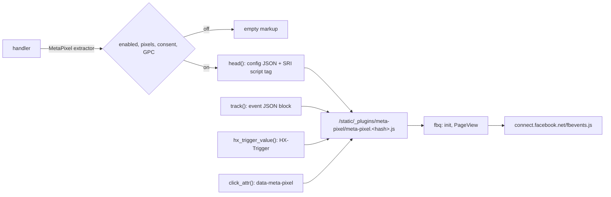

# autumn-plugin-meta-pixel

Meta Pixel plugin for [autumn-web](https://github.com/autumn-foundation/autumn) 0.8.

- **No inline JavaScript.** The loader is a plugin asset (autumn 0.8 `PluginAssets`): a content-hashed, `immutable`, same-origin URL with SRI.
- **Consent first.** No pixel markup until the visitor consents (`autumn_web::consent`). No pixel for a Global Privacy Control request.
- **Typed events.** All Meta standard events, checked custom events, typed parameters, `eventID`, and single-pixel targets.
- **htmx ready.** Events fire from data blocks (also after a swap), from an `HX-Trigger` header, or from a click attribute.
- **Startup checks.** Bad config or a CSP that blocks the pixel stops the app start. The error gives the fix.



## Install

```toml
[dependencies]
autumn-plugin-meta-pixel = "0.1"
```

```rust,ignore
use autumn_plugin_meta_pixel::MetaPixelPlugin;

autumn_web::app()
    .routes(routes![index])
    .plugin(MetaPixelPlugin::new())
    .run()
    .await;
```

```toml
# autumn.toml
[meta_pixel]
pixel_ids = ["1234567890123456"]

[profile.dev.meta_pixel]
enabled = false
```

## Use

Take `MetaPixel` as a handler argument. It never fails. When the pixel is off, each method gives empty markup or `None`.

```rust,ignore
use autumn_plugin_meta_pixel::{Event, MetaPixel, StandardEvent};

#[get("/thanks")]
async fn thanks(pixel: MetaPixel) -> Markup {
    let purchase = Event::standard(StandardEvent::Purchase)
        .value(25.0)
        .currency("EUR")
        .event_id("order-1001");
    let call = Event::standard(StandardEvent::Contact);
    html! {
        head { (pixel.head()) }
        body {
            (pixel.noscript())
            (pixel.track(&purchase))
            button data-meta-pixel=[pixel.click_attr(&call)] { "Call us" }
        }
    }
}
```

| Method | Gives | Fires |
|---|---|---|
| `head()` | Config data block and loader `<script>` (SRI, `defer`). Put it in `<head>`. | `init` for each pixel, then `PageView`. |
| `noscript()` | Hidden `PageView` image for each pixel. Put it at the start of `<body>`. | With no JavaScript. |
| `track(&event)` | Event data block. | Once, at page load or after an htmx swap. |
| `click_attr(&event)` | Value for `data-meta-pixel`. | On a click on the element or a child. |
| `hx_trigger_value(&[event])` | `HX-Trigger` header value (ASCII). | After the htmx request. |
| `is_active()` | `true` when this page gets the pixel. | — |

Custom events: `Event::custom("ShareClick")?`. The name is 1 to 50 of `A-Z a-z 0-9 _`.
Custom parameters: `.param("plan", "pro")`.
One pixel only: `.for_pixel("123")`. The ID must be in `pixel_ids`, else the event does not render.

JavaScript can fire an event too: `window.autumnMetaPixel.track({name: "Lead", custom: false, params: {}})`.

htmx reads one `HX-Trigger` header. Do not add a second one.

## Consent

With `require_consent = true` (default), the plugin renders nothing until
`Consent::allows(consent_category, consent_policy_version)` is `true`. Record consent with the same category:

```rust,ignore
autumn_web::consent::accept_all_cookie(&["marketing"], POLICY_VERSION)
```

Pages with the pixel vary per visitor. Do not put them behind `CacheResponseLayer` (see autumn's cookie-consent guide).

## Content-Security-Policy

The pixel needs these sources. autumn's default CSP does not have them.

| Directive | Source |
|---|---|
| `script-src` | `'self'` and `https://connect.facebook.net` (the origin of `script_url`) |
| `img-src` | `https://www.facebook.com` |
| `connect-src` | `https://www.facebook.com` |

At startup the plugin checks `security.headers.content_security_policy`. When a source is missing, the start fails and the error gives the fixed policy. For autumn's default CSP:

```toml
[security.headers]
content_security_policy = "default-src 'self'; img-src 'self' data: https://www.facebook.com; style-src 'self' 'unsafe-inline'; script-src 'self' https://connect.facebook.net; connect-src 'self' https://www.facebook.com; form-action 'self'; frame-ancestors 'none'; base-uri 'self'"
```

`csp::with_meta_pixel_sources(csp, origin)` gives the same fix in code. An explicit CSP turns off autumn's automatic nonce. `'strict-dynamic'` blocks the loader; the plugin does not support it.

## Config

`[meta_pixel]` in `autumn.toml`, `[profile.<name>.meta_pixel]`, `autumn-<profile>.toml`, then `AUTUMN_META_PIXEL__<KEY>` env vars (a list is comma-separated).

| Key | Default | Meaning |
|---|---|---|
| `enabled` | `true` | Off switch. |
| `pixel_ids` | `[]` | Pixel IDs, 1 to 32 digits each. Empty means off. |
| `page_view` | `true` | Send `PageView` at page load. |
| `history_page_views` | `true` | Let the pixel send `PageView` on `pushState` (`hx-push-url`). `false` sets `fbq.disablePushState`. |
| `auto_config` | `true` | Let the pixel collect clicks and page metadata. `false` sends `fbq('set', 'autoConfig', false, id)`. |
| `noscript` | `true` | Render the `noscript` image. |
| `require_consent` | `true` | Render nothing before consent. |
| `consent_category` | `"marketing"` | Consent category. Not `necessary`. |
| `consent_policy_version` | `1` | Your cookie policy version. |
| `honor_gpc` | `true` | Off for `Sec-GPC: 1` and `navigator.globalPrivacyControl`. |
| `script_url` | `https://connect.facebook.net/en_US/fbevents.js` | `fbevents.js` URL. HTTPS only. |
| `csp_check` | `"error"` | `"error"`, `"warn"`, or `"off"`. |

## Test your templates

```rust,ignore
let pixel = MetaPixel::for_request(&config, &headers);
assert!(pixel.head().into_string().contains("autumn-meta-pixel-config"));
```

In a `TestApp`, set a CSP with the pixel sources, or `csp_check = CspCheck::Off`.

## Security notes

- Config and events are JSON in `<script type="application/json">` blocks. The JSON escapes `<`, `>`, and `&`, so text cannot close the block. `verus/policy.rs` proves this.
- `fbevents.js` is third-party code with full page access. Meta changes it often, so it has no SRI hash. The consent gate, GPC, and CSP host list limit it.
- The plugin sends no personal data. Event parameters come from your code. Do not put e-mail addresses or phone numbers in them.

## Out of scope

Conversions API (server events; use `event_id` to match them later), advanced matching, a consent banner (autumn has one).

## Develop

See [CLAUDE.md](CLAUDE.md), [docs/plan.md](docs/plan.md), and [docs/adr](docs/adr).

License: Apache-2.0.
