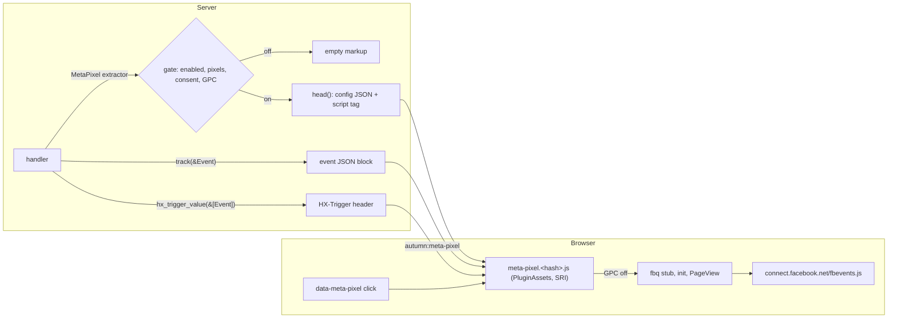

# Plan: `autumn-plugin-meta-pixel`

Style: ASD-STE100. Short sentences. Active voice.

## 1. Problem

Shops and lead-generation sites use the Meta Pixel to measure ads.
The usual install is an inline `` in an event parameter closes the data block. XSS. | Escape `<`, `>`, `&` in all JSON. Proven in the spec: the output has none of these bytes. |
| The pixel loads before consent. GDPR and ePrivacy fine. | Server-side gate with `autumn_web::consent::Consent`. No markup before consent. Proven in the spec. |
| `consent_category = "necessary"`. The gate is always open. | Config check rejects it. |
| Visitor sends Global Privacy Control. | `honor_gpc` (default on). Server reads `Sec-GPC: 1`. The loader reads `navigator.globalPrivacyControl`. |
| A typo in the pixel ID sends data to a stranger. | Pixel IDs are 1 to 32 ASCII digits. Startup fails on a bad ID. |
| A bad custom event name. Meta drops it. | Names are 1 to 50 chars of `A-Z a-z 0-9 _`. |
| Double `PageView` on htmx navigation. Meta already tracks `pushState`. | Do not add our own history `PageView`. `history_page_views = false` sets `fbq.disablePushState`. |
| An event fires twice when htmx swaps the same content again. | The loader marks each data block when it fires. |
| Events leak through `HX-Trigger` with no consent. | `hx_trigger_value` gives `None` when the pixel is off. |
| The `noscript` image loads on `hx-boost` and history restore (htmx parses with scripting off). | `noscript()` is empty for htmx requests. The loader removes the plugin `noscript` element. Found in review, tested in Chromium. |
| A morph swap removes the done attribute. The block fires again. | The loader keeps fired blocks in a `WeakMap`. |
| Other code on the page starts a pixel. `track` sends our events to it too. | The loader sends `trackSingle` to each configured pixel. |
| The visitor withdraws consent, but `hx-boost` keeps `fbevents.js` in memory. | `REVOKE_HX_TRIGGER`: the loader calls `fbq('consent', 'revoke')` and stops. |
| Plugin not installed, but a template uses the extractor. A page fails. | The extractor never fails. It gives an off pixel and logs a warning. |
| Dev and test traffic goes to Meta. | `enabled = false` per profile (`[profile.dev.meta_pixel]`). |
| The `noscript` image uses an inline `style`. A nonce CSP blocks it. | Use the `hidden` attribute. |
| A shared cache stores a page with the pixel and gives it to a visitor with no consent. | Document: pages that read consent must not use `CacheResponseLayer`. Same rule as autumn's consent guide. |

## 5. Six thinking hats

- **White (facts):** The pixel loads `https://connect.facebook.net/<locale>/fbevents.js`. It sends hits to `https://www.facebook.com/tr`. CSP needs `script-src connect.facebook.net`, `img-src www.facebook.com`, and `connect-src www.facebook.com`. `fbq` has `init`, `track`, `trackCustom`, `trackSingle`, `trackSingleCustom`, `set autoConfig`, and `consent`. The fourth `track` argument holds `eventID`. The pixel tracks `pushState` by default. `fbq.disablePushState = true` stops it. autumn 0.8 serves `PluginAssets` under `/static/_plugins/<ns>/`.
- **Red (feelings):** Users want `(pixel.head())` in the layout and nothing more. A red CSP console error with no hint feels bad. A startup error that gives the fix feels good.
- **Black (risks):** A third-party script runs with full page access. We cannot pin its hash: Meta changes `fbevents.js` often. So the plugin limits it with consent, GPC, and the CSP host list. The consent decision comes from a cookie, so pages vary per visitor. HTTP caches must not share them.
- **Yellow (benefits):** One install. No inline JavaScript. Works under the default CSP plus three hosts. Standard events catch typos at compile time. Custom event names get a check at run time. Consent is the default.
- **Green (ideas):** Conversions API with the same `Event` type and `eventID`. Advanced matching with SHA-256 on the server. An upstream seam that lets a plugin add CSP sources.
- **Blue (process):** Spec the pure policy (Verus). Write failing tests (Rust and JavaScript). Implement. Refactor. Review with agents from several angles. Check each AC.

## 6. Design

Modules:

- `policy` — pure functions. JSON escape for HTML, pixel ID and event name checks, load decision. Verified core.
- `config` — `[meta_pixel]` config. Layered TOML and env. Validation.
- `event` — `StandardEvent`, `Event`, `Content`.
- `csp` — CSP parse, check, and fix.
- `assets` — the `PluginAssets` bundle.
- `pixel` — the `MetaPixel` extractor and its markup.
- `plugin` — `MetaPixelPlugin`.

## 7. Data flow rules

- The server is the gate. The loader also checks GPC, because a browser can send GPC without `Sec-GPC`.
- The server never sends personal data. Event parameters come from the app.
- One JSON format for an event, in all three paths (data block, `HX-Trigger`, `data-meta-pixel`).

## 8. Acceptance criteria

- **AC1** `MetaPixelPlugin` implements `autumn_web::plugin::Plugin`. One call installs it. It declares a contract for autumn-web 0.8 and the `[meta_pixel]` config section.
- **AC2** The plugin serves its loader through the autumn 0.8 `PluginAssets` seam: a content-hashed `immutable` URL and a plain `must-revalidate` URL. `autumn routes` shows the asset routes as public. The head tag has `integrity` and `crossorigin`.
- **AC3** The plugin adds no inline JavaScript. Config and events are JSON data blocks. All JSON escapes `<`, `>`, and `&`.
- **AC4** `head()` inits each configured pixel and sends `PageView` (configurable). `noscript()` gives a hidden `PageView` image for each pixel.
- **AC5** Typed events: all Meta standard events, custom events with a checked name, typed parameters (`value`, `currency`, `content_ids`, `contents`, and others), extra custom parameters, `eventID`, and a single-pixel target.
- **AC6** A handler can fire an event three ways: a data block in the page or in an htmx swap, an `HX-Trigger` header value, and a `data-meta-pixel` click attribute. Each fires once.
- **AC7** Consent gate: with `require_consent` (default on), no pixel markup and no `HX-Trigger` value until `Consent::allows(category, version)`. Global Privacy Control turns the pixel off (server and browser). `enabled = false` turns it off.
- **AC8** Startup checks: bad config fails the app start with a clear message. A CSP that blocks the pixel hosts fails the start with the fixed CSP (`csp_check = "error"`), or logs a warning (`"warn"`), or does nothing (`"off"`).
- **AC9** Serde config with validation, layered TOML (`autumn.toml`, inline profile, profile file), and `AUTUMN_META_PIXEL__*` env vars.
- **AC10** `history_page_views` and `auto_config` map to `fbq.disablePushState` and `fbq('set', 'autoConfig', false, id)`.
- **AC11** `cargo fmt`, clippy pedantic and nursery are clean. No `unwrap` in production code. Unit, property, integration, and JavaScript tests pass. Coverage is 85% or more. CI runs these.
- **AC12** Verus specs state the policy invariants. Proofs pass.
- **AC13** README, CLAUDE.md, ADRs, and a Mermaid diagram. All docs use ASD-STE100.

## 9. Out of scope

Conversions API. Advanced matching. A consent banner (autumn has one). Metrics and health (the plugin does no I/O per request).
